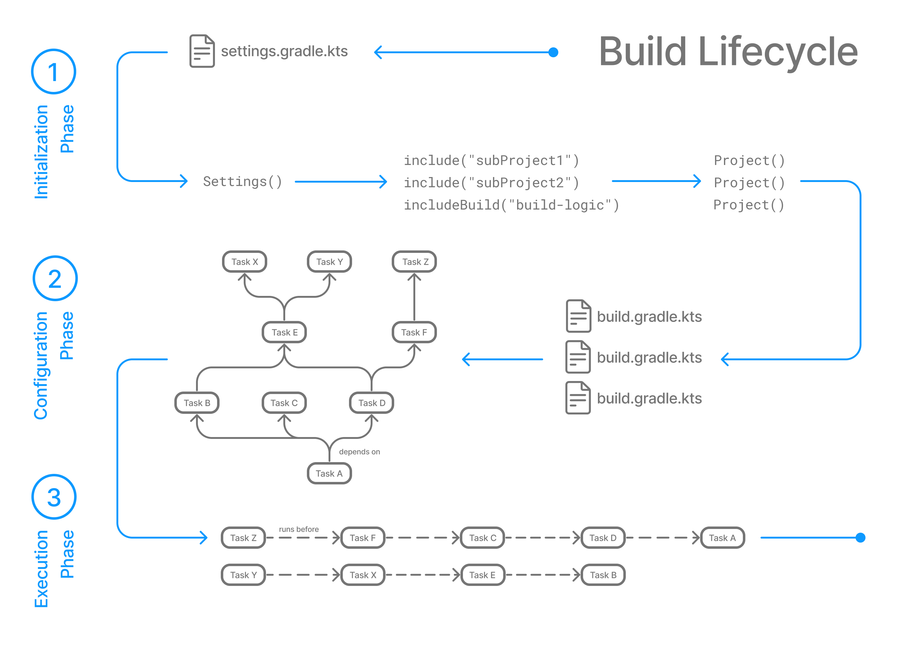

// Copyright (C) 2023 Gradle, Inc.
//
// Licensed under the Creative Commons Attribution-Noncommercial-ShareAlike 4.0 International License.;
// you may not use this file except in compliance with the License.
// You may obtain a copy of the License at
//
//      https://creativecommons.org/licenses/by-nc-sa/4.0/
//
// Unless required by applicable law or agreed to in writing, software
// distributed under the License is distributed on an "AS IS" BASIS,
// WITHOUT WARRANTIES OR CONDITIONS OF ANY KIND, either express or implied.
// See the License for the specific language governing permissions and
// limitations under the License.

[[build_lifecycle]]
= Build Lifecycle

* build author
    ** define
        *** tasks
        *** dependencies between tasks /
            **** tasks -- will be executed -- in order of their dependencies
* build scripts & plugins
    ** configure dependency graph
        *** _Example:_ if project tasks include `build`, `assemble`, `createDocs` -> build script(s) ensure that they are executed -- in the order -- `build` -> `assemble` -> `createDoc`

== Task Graphs

* built by Gradle | *before* executing any task /
    ** plugins & build scripts -- contribute to the -- task graph / -- via --
        *** <<tutorial_using_tasks.adoc#sec:task_dependencies,task dependency mechanism>>
        *** <<incremental_build.adoc#sec:task_inputs_outputs,annotated inputs/outputs>>
* http://en.wikipedia.org/wiki/Directed_acyclic_graph[Directed Acyclic Graph^] (DAG) /
    ** across all projects | build
* _Example:_ 2 example task graphs /
    ** 1 abstract & other concrete
    ** dependencies between tasks -- are represented as -- arrows

[[sec:build_phases]]
== Build Phases

* Gradle build
    ** == 👀 3 phases 👀 / run in order

image::author-gradle-1.png[]

Phase 1. Initialization::
* Detects the `settings.gradle(.kts)` file
* Creates a link:{groovyDslPath}/org.gradle.api.initialization.Settings.html[`Settings`] instance
* Evaluates the settings file -- to determine -- | the build,
    ** projects & subprojects
    ** included builds
* Creates a link:{groovyDslPath}/org.gradle.api.Project.html[`Project`] instance / EVERY project
Phase 2. Configuration::
* Evaluates the build scripts, `build.gradle(.kts)`, / EVERY project | build
* Creates a task graph / requested tasks
Phase 3. Execution::
* Schedules & executes the selected tasks /
    ** dependencies between tasks -- determine -- execution order
    ** execution of tasks -- can occur in -- parallel

=== Example

* goal
    ** parts of settings & build files / -- correspond to -- various build phases

====
// 1. Kotlin
// 1.1 settings.gradle.kts
include::../../../../snippets/buildlifecycle/basic/kotlin/settings.gradle.kts[]
// 1.2 build.gradle.kts
include::../../../../snippets/buildlifecycle/basic/kotlin/build.gradle.kts[]
====

====
// 2. Groovy
// 2.1 settings.gradle
include::../../../../snippets/buildlifecycle/basic/groovy/settings.gradle[]
// 2.2 build.gradle
include::../../../../snippets/buildlifecycle/basic/groovy/build.gradle[]
====

* if you want to execute the `test` and `testBoth` tasks
    ** `configured` task never configures ❓
        *** Reason: 🧠Gradle ONLY configures requested tasks & their dependencies🧠

[source.multi-language-sample,kotlin]
----
> gradle test testBoth
include::../../../../snippets/buildlifecycle/basic/tests/buildlifecycle.out[]
----
[source.multi-language-sample,groovy]
----
> gradle test testBoth
include::../../../../snippets/buildlifecycle/basic/tests/buildlifecycle.out[]
----

[.text-right]
**Next Step:** <<writing_settings_files.adoc#writing_settings_files,Learn how to write Settings files>> >>
