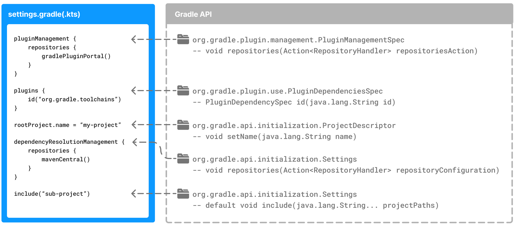

// Copyright (C) 2023 Gradle, Inc.
//
// Licensed under the Creative Commons Attribution-Noncommercial-ShareAlike 4.0 International License.;
// you may not use this file except in compliance with the License.
// You may obtain a copy of the License at
//
//      https://creativecommons.org/licenses/by-nc-sa/4.0/
//
// Unless required by applicable law or agreed to in writing, software
// distributed under the License is distributed on an "AS IS" BASIS,
// WITHOUT WARRANTIES OR CONDITIONS OF ANY KIND, either express or implied.
// See the License for the specific language governing permissions and
// limitations under the License.

[[writing_settings_files]]
= Writing Settings Files

* <<build_lifecycle.adoc#sec:initialization,initialization phase>>
    ** first phases | build lifecycle
    ** requirements
        *** place | <<directory_layout#dir:project_root,project root directory>>
    ** 👀 once `settings.gradle(.kts)` is found -> Gradle instantiates a link:{groovyDslPath}/org.gradle.api.initialization.Settings.html[`Settings`] object 👀
* `Settings` object
    ** uses
        *** declare ALL the projects / -- be included in the -- build

[[sec:settings_script]]
== Settings Scripts

* == `settings.gradle` or `settings.gradle.kts`

image::author-gradle-3.png[Settings,500,63,align="left"]

* `Settings()`
    ** == settings script
    ** once it's executed -> `Settings` is configured

== The `Settings` Object

* 1to1 between `settings.gradle(.kts)` -- & -- `Settings` instance
* == part of the link:{javadocPath}/org/gradle/api/initialization/Settings.html[Gradle API]
    ** | Groovy DSL, link:{groovyDslPath}/org.gradle.api.initialization.Settings.html[`Settings` object documentation]
    ** | Kotlin DSL, link:{kotlinDslPath}/gradle/org.gradle.api.initialization/-settings/index.html[`Settings` object documentation]
* 👀top-level properties & blocks | settings script -- are part of the -- Settings API 👀
* set the root project name

[source,kotlin]
----
settings.rootProject.name = "root"

// way to shorten
rootProject.name = "root"
----

[[sec:standard_settings_properties]]
=== Standard `Settings` properties

[%autowidth.stretch]
|===
| Name | Description

| `buildCache`
| build cache configuration

| `plugins`
| container of plugins / -- have been applied to the -- settings

| `rootDir`
| root directory of the build

== project directory of the root project

| `rootProject`
| root project of the build

| `settings`
| Returns this settings object.
|===

* common methods

[%autowidth.stretch]
|===
| Name | Description

| `include()`
| Adds the given projects to the build.

| `includeBuild()`
| Includes a build at the specified path to the composite build.
|===

== Settings Script structure

* Settings script
    ** == 👀series of method calls -- to the -- Gradle API 👀 /
        *** built | DSLs
        *** `{ ... }` block
            **** method calls / -- are mapped to -- Gradle API methods
            **** naming
                ***** _lambda_ | Kotlin or
                ***** _closure_ | Groovy
            **** The code | function -- is executed against a -- `this` object
                ***** naming
                    ****** _receiver_ | Kotlin lambda
                    ****** _delegate_ | Groovy closure
                ***** -- is determined by -- Gradle
    ** executed line by line, top -- to -> bottom
    ** _Example:_ settings.gradle.kts -> settings object

        [source,kotlin, name= "settings.gradle.kts"]
        ----
        include("app")
        ----

        [source,kotlin]
        ----
        settings.include("app")
        ----

    ** Kotlin or Groovy features can be used
        *** _Example:_ `include` used many times | subprojects -- can be replaced by -- iteration of a list (this logic -- should be developed in a -- plugin)

            [source,kotlin]
            ----
            rootDir.listFiles().filter { it.isDirectory && (new File(it, "build.gradle.kts").exists()) }.forEach {
                include(it.name)
            }
            ----

* `plugins{ }`
    ** == block / it's a method invocation
    ** == short form for

        [source,kotlin]
        ----
        plugins(function() {
            id("plugin")
        })
        ----

    ** `this` -- of the method invocation `id("plugin")` object -- is of type link:{javadocPath}/org/gradle/plugin/use/PluginDependenciesSpec.html[`PluginDependenciesSpec`]

* _Example:_

====
[.multi-language-sample]
=====
.settings.gradle.kts
[source,kotlin]
----
pluginManagement {                                          // define location of plugins
    repositories {
        gradlePluginPortal()
        google()
    }
}

plugins {                                                   // Apply settings plugins
    id("org.gradle.toolchains.foojay-resolver-convention") version "0.8.0"
}

rootProject.name = "root-project"                           // Define the root project name

dependencyResolutionManagement {                            // Define dependency resolution strategies
    repositories {
        mavenCentral()
    }
}

include("sub-project-a")                                    // Add subprojects | build
include("sub-project-b")
include("sub-project-c")
----
=====

[.multi-language-sample]
=====
.settings.gradle
[source,groovy]
----
pluginManagement {                                          // location of plugins
    repositories {
        gradlePluginPortal()
        google()
    }
}

plugins {                                                   // Apply settings plugins
    id 'org.gradle.toolchains.foojay-resolver-convention' version '0.8.0'
}

rootProject.name = 'root-project'                           // Define the root project name

dependencyResolutionManagement {                            // Define dependency resolution strategies
    repositories {
        mavenCentral()
    }
}

include('sub-project-a')                                    // Add subprojects | build
include('sub-project-b')
include('sub-project-c')
----
=====
====

=== 1. Define the location of plugins

* link:{javadocPath}/org/gradle/plugin/management/PluginManagementSpec.html[`pluginManagement`]
    ** allows
        *** managing -- for your -- build
            **** plugin versions
            **** repositories
    ** == centralized way to define
        *** plugins / should be used | your project
        *** from which repositories -- they should be -- resolved

[source,kotlin]
----
pluginManagement {
    repositories {
        gradlePluginPortal()
        google()
    }
}
----

=== 2. Apply settings plugins

* link:{javadocPath}/org/gradle/plugin/use/PluginDependenciesSpec.html[PluginDependenciesSpec]
    ** optional
    ** _Example:_
        *** link:https://plugins.gradle.org/plugin/com.gradle.develocity[Develocity plugin]
        *** link:https://plugins.gradle.org/plugin/org.gradle.toolchains.foojay-resolver-convention[Toolchain Resolver plugin]
* Plugins / applied | settings file -> ONLY affect the `Settings` object

[source,kotlin]
----
plugins {
  id("org.gradle.toolchains.foojay-resolver-convention") version "0.8.0"
}
----

=== 3. Define the root project name

* link:{javadocPath}/org/gradle/api/initialization/ProjectDescriptor.html[`rootProject.name` property]
    ** 1! / build

[source,kotlin]
----
rootProject.name = "root-project"
----

=== 4. Define dependency resolution strategies

* link:{javadocPath}/org/gradle/api/initialization/resolve/DependencyResolutionManagement.html[DependencyResolutionManagement]
    ** optional
    ** allows
        *** for dependency resolution -- across -- your project(s)
            **** defining rules
            **** defining configurations
        *** including version catalogs
    ** == centralized way, for dependency resolution, to
        *** manage
        *** customize

[source,kotlin]
----
dependencyResolutionManagement {
    repositoriesMode.set(RepositoriesMode.PREFER_PROJECT)
    repositories {
        mavenCentral()
    }
}
----

=== 5. Add subprojects to the build

* link:{javadocPath}/org/gradle/api/initialization/Settings.html[`include`]
    ** == statement /
        *** allows
            **** adding subprojects
                ***** == define the structure of the project

[source,kotlin]
----
include("app")
include("business-logic")
include("data-model")
----

* link:{javadocPath}/org/gradle/api/initialization/IncludedBuild.html[`includeBuild`]
    ** == statement /
        *** allows
            **** adding entire builds

[.text-right]
**Next Step:** <<writing_build_scripts.adoc#writing_build_scripts,Learn how to write Build scripts>> >>
