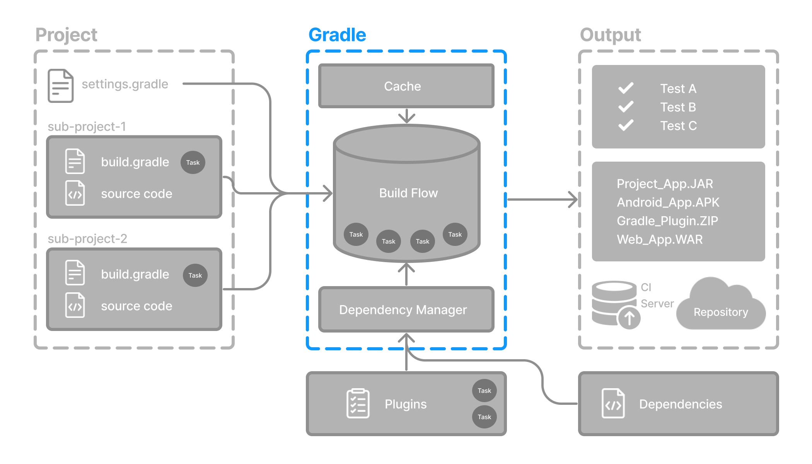

// Copyright (C) 2023 Gradle, Inc.
//
// Licensed under the Creative Commons Attribution-Noncommercial-ShareAlike 4.0 International License.;
// you may not use this file except in compliance with the License.
// You may obtain a copy of the License at
//
//      https://creativecommons.org/licenses/by-nc-sa/4.0/
//
// Unless required by applicable law or agreed to in writing, software
// distributed under the License is distributed on an "AS IS" BASIS,
// WITHOUT WARRANTIES OR CONDITIONS OF ANY KIND, either express or implied.
// See the License for the specific language governing permissions and
// limitations under the License.

[[command_line_interface_basics]]
= Command-Line Interface Basics

* primary **method of interacting with Gradle**

* `gradle [taskName1 taskName2 ..] [--optionNames...]` / `gradle [--optionNames...] [taskName...]`
    ** `[--optionNames...]`
        *** if it accepts values -> `--optionName1=optionValue1`
        *** 👁️allowed passing before OR after 👁️
        *** if it enables something → negation is `[--no-optionNames...]`
        *** some are added by plugins

== Command-line usage

[[command_line_executing_tasks]]
=== Executing tasks

* `gradle :taskName`
    ** executes the task `taskName` + ALL it's dependencies | root project
    ** Check <<tutorial_using_tasks.adoc#sec:task_dependencies,dependencies>>

[[disambiguate_task_options_from_built_in_options]]
=== Specify options for tasks

* `gradle taskName --exampleOption=exampleValue`
    ** pass an option

* Check <<command_line_interface.adoc#command_line_interface,Gradle Command Line Interface reference>>

[.text-right]
**Next Step:** <<settings_file_basics.adoc#settings_file_basics,Learn about the Settings file>> >>
