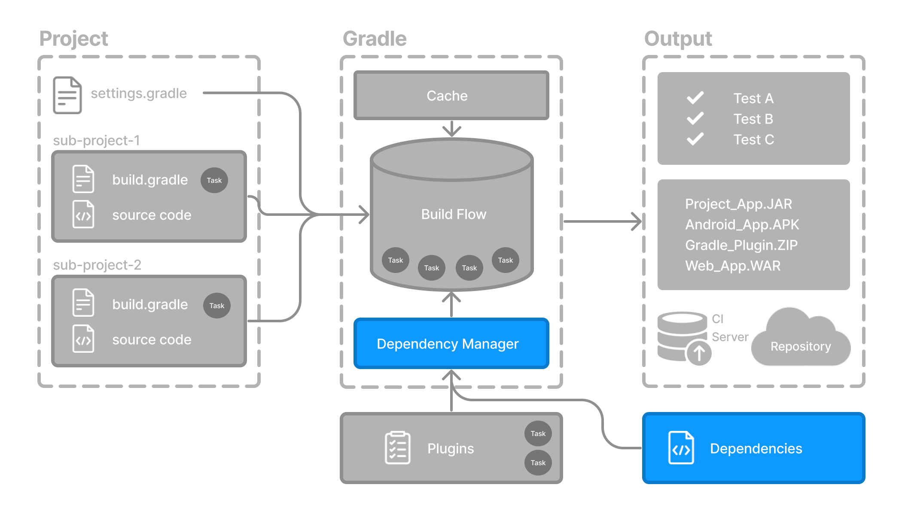

// Copyright (C) 2023 Gradle, Inc.
//
// Licensed under the Creative Commons Attribution-Noncommercial-ShareAlike 4.0 International License.;
// you may not use this file except in compliance with the License.
// You may obtain a copy of the License at
//
//      https://creativecommons.org/licenses/by-nc-sa/4.0/
//
// Unless required by applicable law or agreed to in writing, software
// distributed under the License is distributed on an "AS IS" BASIS,
// WITHOUT WARRANTIES OR CONDITIONS OF ANY KIND, either express or implied.
// See the License for the specific language governing permissions and
// limitations under the License.

[[dependency_management_basics]]
= Dependency Management Basics

* := automated technique /
    ** built-in by Gradle
    ** allows about external required resources | project
        *** declare
        *** resolve
            **** -- normally, during the -- build
* dependencies -- refer to --
    ** JARs,
    ** plugins,
    ** libraries,
    ** source code / support building your project

== Version Catalog

* `libs.versions.toml`
    ** := version catalog / centralize your dependency declaration
    ** placed | `gradle` directory
        *** -> -- can be used automatically by -- Gradle and IDEs
    ** allows
        *** making easier between subprojects, share
            **** dependencies
            **** version configurations
        *** getting autocompletions by the IDE
    ** placed under ‘/gradle’
    ** sections
        *** `[versions]`
            **** == versions of
                ***** libraries &
                ***** plugins
        *** `[libraries]`
            **** libraries / used | "build.gradle*"
        *** `[bundles]`
            **** == define set of dependencies
        *** `[plugins]`
            **** == define plugins
* _Example:_

[source,gradle/libs.versions.toml]
----
[versions]
androidGradlePlugin = "7.4.1"
mockito = "2.16.0"

[libraries]
googleMaterial = { group = "com.google.android.material", name = "material", version = "1.1.0-alpha05" }
mockitoCore = { module = "org.mockito:mockito-core", version.ref = "mockito" }

[plugins]
androidApplication = { id = "com.android.application", version.ref = "androidGradlePlugin" }
----

== Declaring Your Dependencies

* `build.gradle` or `build.gradle.kts`
    ** `dependencies`
        *** := block /
            **** add a dependency | your project
        *** -- are grouped by -- *configurations*
            **** `implementation` allows, about production code
                ***** running
                ***** compiling
            **** `testImplementation` allows, about test code
                ***** running
                ***** compiling
            **** ...
* _Example:_ `build.gradle.kts` / use the previous version catalog

[source,kotlin]
----
plugins {
   alias(libs.plugins.androidApplication)  // Apply Android Gradle plugin
}

dependencies {
    // Dependency on a remote binary -- to -- compile and run the code
    implementation(libs.googleMaterial)    // <2>

    // Dependency on a remote binary -- to -- compile and run the test code
    testImplementation(libs.mockitoCore)   // <3>
}
----

== Viewing Project Dependencies

* `/gradlew :app:dependencies`
    ** check app’s dependency tree

* Check <<dependency_management_terminology.adoc#dependency_management_terminology,Dependency Management chapter>>

[.text-right]
**Next Step:** <<task_basics.adoc#task_basics,Learn about Tasks>> >>
