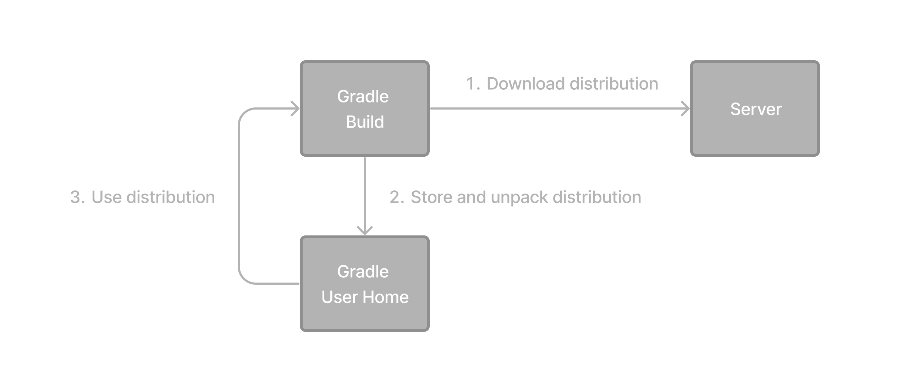

// Copyright (C) 2023 Gradle, Inc.
//
// Licensed under the Creative Commons Attribution-Noncommercial-ShareAlike 4.0 International License.;
// you may not use this file except in compliance with the License.
// You may obtain a copy of the License at
//
//      https://creativecommons.org/licenses/by-nc-sa/4.0/
//
// Unless required by applicable law or agreed to in writing, software
// distributed under the License is distributed on an "AS IS" BASIS,
// WITHOUT WARRANTIES OR CONDITIONS OF ANY KIND, either express or implied.
// See the License for the specific language governing permissions and
// limitations under the License.

[[gradle_wrapper_basics]]
= Gradle Wrapper Basics

* **recommended way to execute any Gradle build**

image::gradle-basic-2.png[]

* how does it work?

* -- based on -- OS
    ** (Linux or OSX) `gradlew`
    ** (Windows) `gradlew.bat`
* benefits
    ** standardizes a project | given Gradle version
    ** SAME Gradle version / different users
    ** provision the Gradle version / different execution environments (IDEs, CI servers...).

[[sec:using_the_wrapper]]
== Using the Gradle Wrapper

* via
    ** non-Gradle wrapper

    $ gradle build

    ** wrapper
        *** | Linux or OSX

    $ ./gradlew build      // | root directory

        *** | Windows PowerShell

    $ .\gradlew.bat build  // | root directory

* Check <<gradle_wrapper.adoc#gradle_wrapper_reference,Gradle Wrapper reference>>

[.text-right]
**Next Step:** <<command_line_interface_basics.adoc#command_line_interface_basics,Learn about the Gradle CLI>> >>
