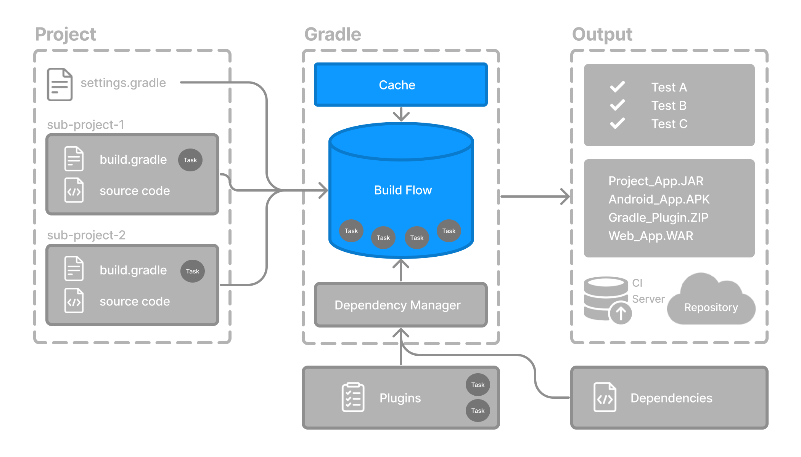

// Copyright (C) 2023 Gradle, Inc.
//
// Licensed under the Creative Commons Attribution-Noncommercial-ShareAlike 4.0 International License.;
// you may not use this file except in compliance with the License.
// You may obtain a copy of the License at
//
//      https://creativecommons.org/licenses/by-nc-sa/4.0/
//
// Unless required by applicable law or agreed to in writing, software
// distributed under the License is distributed on an "AS IS" BASIS,
// WITHOUT WARRANTIES OR CONDITIONS OF ANY KIND, either express or implied.
// See the License for the specific language governing permissions and
// limitations under the License.

[[gradle_optimizations]]
= Gradle Incremental Builds and Build Caching

* ⭐ main features to reduce build time ⭐
    ** *incremental builds*
    ** *build caching*

== Incremental builds

* == build / if inputs of the previous build have NOT changed → 👁️ skip running tasks 👁️
    ** _Example:_ if `UP-TO-DATE` task state -> skiped to run
    ** Gradle determine if there are changes | build time about
        *** input
        *** outputs
    ** ⚠️if you switch to other branches → previous build NOT recognized it → incremental build is NOT useful ⚠️
        *** Reason: 🧠 NOT useful, because new build will be necessary 🧠
* requirements
    ** tasks must define their
        *** inputs
        *** outputs
* by default, it's enabled
* ways to display task state
    ** `gradle … --console=verbose`
    ** `org.gradle.console=verbose` | ‘gradle.properties’
        *** -> affect to ALL

== Build caching

* allows
    ** skip work / ALREADY done
* use cases
    ** if 1! file is changed -> there is NO need to rebuild ALL the other files | project
    ** switch to other branches
    ** share across teams
    ** speed up builds
        *** local
        *** CI
* how does it work?
    ** store previous built results
        *** 👁️if the files are NOT used from a long time → Gradle removes them 👁️
    ** if previous built results are needed -> restore them
* `FROM-CACHE`
    ** task state / skipped to run -- thanks to -- build caching
    ** if you do NOT use build caching == local directory has been repopulated -> task state is `UP-TO-DATE`
* types of cache
    ** local
        *** 👁️ if there are others -> this one is checked first 👁️
    ** remote
        *** ways
            **** link:https://hub.docker.com/r/gradle/build-cache-node[Docker image]
            **** Develocity
* Check <<build_cache#build_cache,Build cache chapter>>

[.text-right]
**Next Step:** <<build_scans.adoc#build_scans,Learn about Build Scans>> >>
